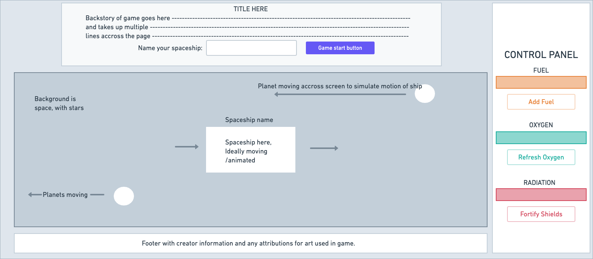

# CREDIT-QUEST-2238
A tomagotchi-type game for Project 0 at General Assembly

=== Overall Game Idea ===
A spaceship that gains credits as it flies through the galaxy. To keep getting credits, you have to keep the spaceship working by pressing buttons on the control panel. Once the player reaches 1 million credits, they have enough to retire and win the game. However, if the spaceship is not maintained, it will blow up. 

=== Link to the Game ===
Play Credit Quest: 2238 in your browser HERE: 
-coming soon-

=== Why a spaceship game? ===
I have been fascinated with space since I was little. Some of the first games I played were space shooters, and even now I still pick up space-themed games like Faster Than Light when I need to unwind. When I learned that my first coding project was a game, it didn't take me long to land on a space theme for the game-design. I had a lot of fun and learned a lot while making Credit Quest: 2238. I hope you give it a go and succeed in your quest for one million credits. 

=== Technologies Used ===
- Javascript
- jQuery
- CSS
- HTML
- Animate.css library

=== User Story ===
1. Screen is grayed out with a see through overlay, which has a little prompt that explains the backstory of the game (You are a new spaceship pilot trying to make enough credits to retire) that includes an input with the title: "Name your spaceship:".
2. Next to the input there will be a button that says "Start your journey!". This button begins the game.
3. When the game begins, the overlay dissapears and the background is the vast vaccum of space. 
4. At the top of the screen is the spaceship's name, with the amount of credits underneath (starting at 0 and increasing by 100 each second). 
5. In the center is the spaceship. 
6. Next to the spaceship on the right side of the screen is the control panel with 2 bars, one for fuel and one for oxygen.
7. Fuel and oxygen reduce overtime at different, steady intervals.
8. Underneath the bars are buttons that the user will push to maintain these metrics. 
9. If fuel/oxygen reach 0, the spaceship blows up and the game ends. 
10. If the user maintains the ship until they have 10,000 credits, thier ship will upgrade (with a new picture).
11. The new ship gains credits at a rate of 1000 per second, but they have to keep track of radiation, which functions like oxygen/fuel but increases overtime instead of decreasing. 
12. The user once again gets an upgrade at 100,000 credits: the new ship will gain credits at a rate of 5000 per second but they will have a fourth metric to track: blanacing the reactor, which changes 10 degrees up or down at random. 
13. If the user maintains the ship until they reach 1 million credits, they retire and win the game. 

=== WIREFRAME for MVP ===

///=== GAME CREATION PROCESS ===///
=== Breakdown of Milestones ===
1. Finish overall planning on README file - DONE
2. Finish fleshing out with: add explanation of what project is, why I made it, explanation of technologies used, etc. - DONE
3. Reformat README to be half sales-pitch/half explanation - DONE
4. Create wireframe to visualize the final product on the screen - DONE
5. Add to README file - DONE
7. Index.html: Add boilerplate, links to css and js file, and link to jQuery - DONE
8. Add semantic HTML: a header, main, aside, and footer - DONE
9. Put content in header: title, backstory paragraph, input for spaceship name, button to start game - DONE
10. Put content in main: img for background, imgs for 3 spaceships - DONE
11. Put content in aside: bars/counts for fuel/oxygen/radiation, buttons to increase/decrease each of those stats - DONE
12. Put content in footer: author name, any attributions for content used, link to github? - DONE
13. Assign classes/ids, add any necessary spans/divs, other appropriate content - DONE
14. Add CSS defaults/basics to main.css - change spacing and any icons/interactive things that will influence how the JS will function - DONE
15. app.js: Create game class/object - add key/value pairs for starting: credits, fuel, oxygen, and radiation - DONE
16. Add method to start the game after user inputs spaceship name and clicks button - DONE
17. Add method to increase credits by appropriate amount each second - DONE
18. Add method to show increase in credits on game screen - DONE
19. Add method to reduce fuel supply at interval - DONE
20. Add method to maintain fuel supply via button click - DONE
21. Add lose condition if fuel reaches 0, cap fuel at 10 - DONE
22. Add method to reduce oxygen supply at different interval- DONE
23. Add method to maintain oxygen supply via button click - DONE
24. Add lose condition if oxygen reaches 0, cap oxygen at 10 - DONE
25. Add method to increase radiation at another interval - DONE
26. Add method to reduce radiation via button click - DONE
27. Add lose condition if radiation reaches 10, cap radiation at 0 - DONE
28. Add method for upgrading ship at 10,000 credits - decrease interval and increase credits per second 500 - DONE
29. Add a class to update the ship that is displayed to a medium-sized ship - DONE
30. Add method for upgrading ship at 100,000 credits - decrease interval and increase credits per second to 5000 - DONE
31. Add a class to update the ship that is displayed to a large-sized ship - DONE
32. Add win condition for reaching 1 Million credits and retiring - DONE
33. Add game reset to make sure game goes back to start once retirement is reached and acknowleged by user. - DONE
34. Test game functionality and fix any other problems not captured here - DONE
35. Add more advanced styling to main.css - DONE
36. Add padding and margin to make everything look properly spaced - DONE
37. Add a theme with color, fonts, and borders to stylize the page content and buttons - DONE
38. Add animations to the images of the spaceships - DONE
39. Add any other misc styling, animations, and features to make the game come alive - DONE

=== Task Checklist for MVP ===
1. Create a repo for your tomagotchi pet - DONE
2. Make a commit after you finish each one of the following:
3. Instatiate your Tomagotchi - DONE
4. Display a character of your choice on the screen to represent **your spaceship**. - DONE
5. Display the following metrics for **your spaceship**: - DONE
    - Hunger (1-10 scale) -> **Fuel** - DONE
    - Sleepiness (1-10 scale) -> **Oxygen** - DONE
    - Boredom (1-10 scale) -> **Radiation** - DONE
    - Age -> **Credits** - DONE
6. Add buttons to the screen to **interact and maintain your spaceship**. - DONE
7. Add the ability to name your **spaceship**. - DONE
8. Style the page. -DONE
9. Increase **credits overtime**. - DONE
10. **Change** your **spaceship's fuel, oxygen and radiation** metrics on an interval of your choosing. - DONE
11. Your **spaceship** should **explode** if **fuel, oxygen and radiation** hits **0 or** 10. - DONE
12. **Upgrade your spaceship** at certain **credit levels**. - DONE
13. Animate your **spaceship** across the screen while it's alive. - DONE

MVP - DONE!

=== Stretch goals ===
1. DOUBLE CHECK ALL REQUIREMENTS!!! - DONE
2. Remove alert for win/loss condition and replace with modals - DONE
2. restart game button - DONE
3. change fonts to make it pretty + font sizes - DONE
4. refactor code to be more programmatic/DRY - DONE
5. go over spacing and margins again, smooth out details in css - DONE
6. add additional images and css animations - DONE
7. add game log with randomly selected phrases when buttons are pushed - SCRAPPED, not enough space
8. add CSS progress bars to control panel - DONE
9. Rewrite/reformat README file - DONE
10. Change control panel stuff to only show up on upgrades - DONE

=== Future Goals ===
1. add select difficulty buttons to game start overlay that change interval speed /w multiplier

